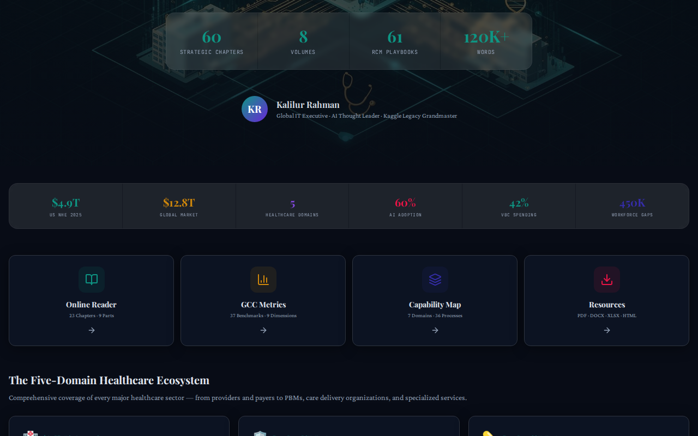
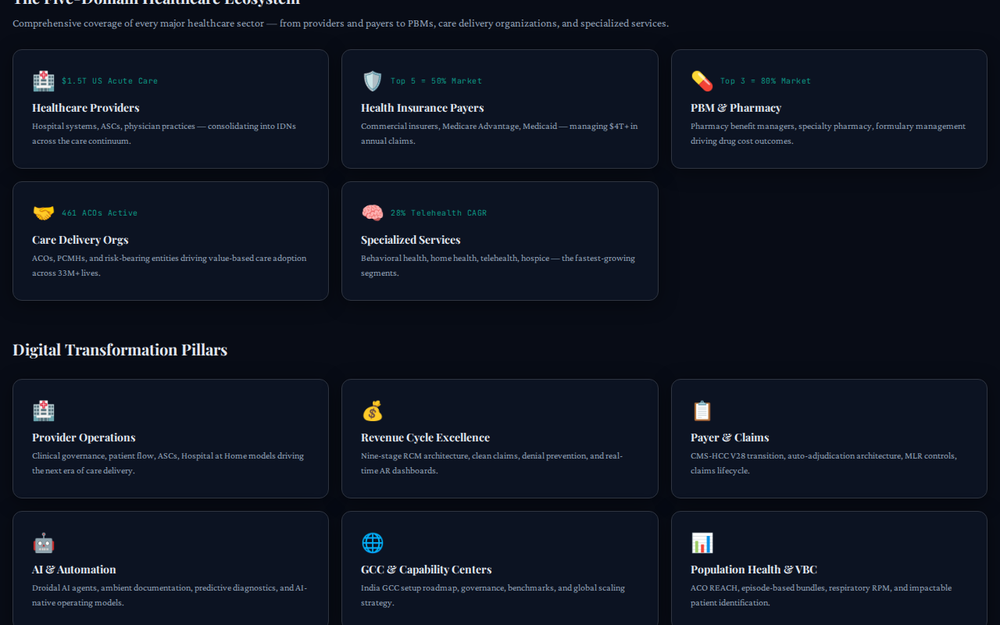
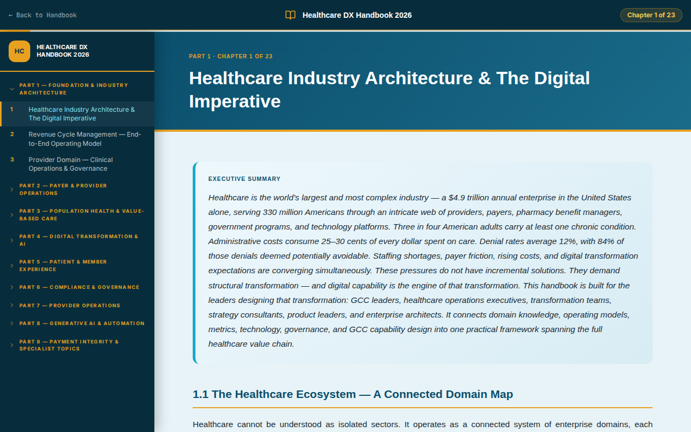
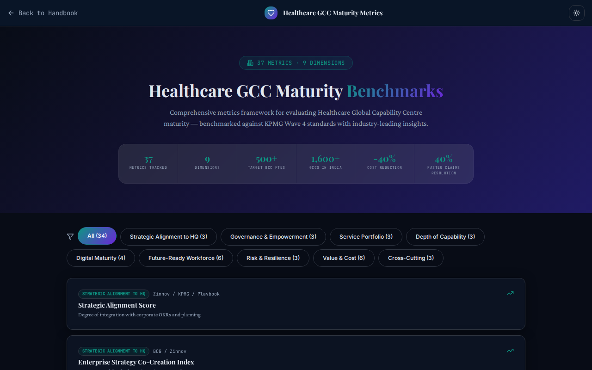
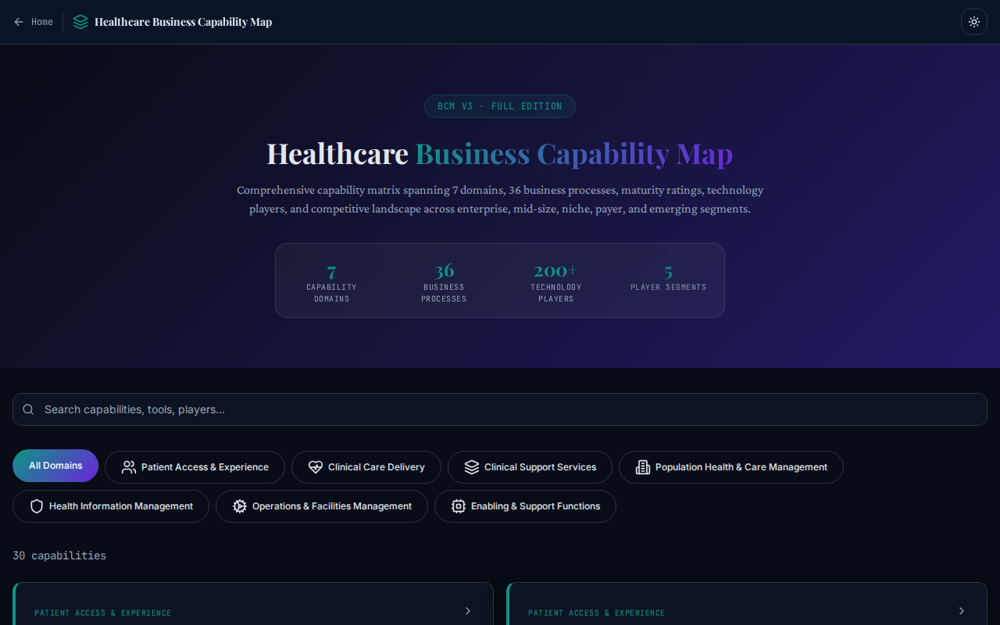

# Healthcare GCC Digital Transformation Handbook

A definitive guide to healthcare Global Capability Center (GCC) transformation in the AI era.

This application is a comprehensive, modern web platform designed to serve as a centralized hub for understanding the value chain, commercial aspects, enablers, and foundations of healthcare GCCs.

## Live Application
🌍 **[Explore the Application](https://kr-healthcare-guidebook-hub.lovable.app)**

---

## Table of Contents
- [Overview](#overview)
- [Key Features & Modules](#key-features--modules)
- [Demo & Screenshots](#demo--screenshots)
  - [Themes](#themes)
  - [Sections](#sections)
  - [Views & Modals](#views--modals)
- [Architecture & Security](#architecture--security)
- [Tech Stack](#tech-stack)
- [Installation & Setup](#installation--setup)
- [License](#license)

---

## Overview

The **Healthcare GCC Digital Transformation Handbook** provides deep insights into the healthcare industry's transformation. It features an interactive, modern interface with different sections outlining the various aspects of the healthcare ecosystem, including Business Continuity Management (BCM), Global Capability Center (GCC) Metrics, and a comprehensive Online Reader.

### Key Features & Modules

- **Interactive UI:** Fully responsive design built with React, TypeScript, and Tailwind CSS.
- **Dynamic Themes:** Built-in Light and Dark mode switching for optimal reading experience.
- **Comprehensive Sections:**
  - **Foundations:** Basic principles and foundational knowledge.
  - **Value Chain:** Insights into the healthcare value chain.
  - **Commercial:** Commercial strategies and models.
  - **Enterprise Enablers:** Key enablers driving enterprise transformation.
- **Online Reader (`/reader`):** A dedicated, distraction-free reading mode to consume individual chapters and volumes.
- **GCC Metrics (`/gcc-metrics`):** A dashboard highlighting essential operational and financial metrics for Healthcare GCCs.
- **BCM (`/bcm`):** Deep dive into Business Continuity Management strategies tailored for the healthcare sector.
- **Search Functionality:** Easily find chapters and resources.

## Demo & Screenshots

Here is an animated demo of the site highlighting different themes and sections:

Here is a comprehensive visual summary of the application across different themes, sections, and views:

### Themes

The main portfolio site supports dynamic themes. Here is how it looks across different modes:

  
  

### Sections

Detailed sections showcasing foundations, value chain, commercial aspects, enablers, and resources.

  
  

### Views & Modules

Views showcasing the main application routes: the Online Reader, GCC Metrics dashboard, and BCM insights.

  
  
  

## Architecture & Security

**Note on Admin Access:**
The Healthcare GCC Digital Transformation Handbook is designed as a **static, purely informational single-page application (SPA)**.
- There is **no backend server** managing users.
- There is **no admin login default**, authentication flow, or authorization logic setup anywhere in the repository.
- All data (chapters, metrics, etc.) is statically served from the `src/data/` directory.

## Tech Stack

- **Frontend:** TypeScript, React, Tailwind CSS, HTML5
- **Icons:** Lucide React
- **Animations:** Framer Motion
- **Build Tool:** Vite
- **Testing/Automation:** Vitest, Playwright

## Installation & Setup

1. Clone the repository:
   \`\`\`bash
   git clone https://github.com/kalilurrahman/kr-healthcare-guidebook-hub.git
   \`\`\`

2. Install dependencies:
   \`\`\`bash
   npm install
   \`\`\`

3. Build and Preview the application:
   \`\`\`bash
   npm run build && npm run preview
   \`\`\`

## License
MIT License
