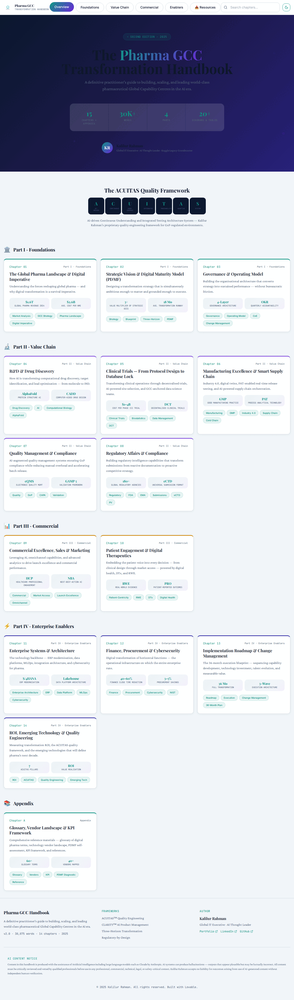
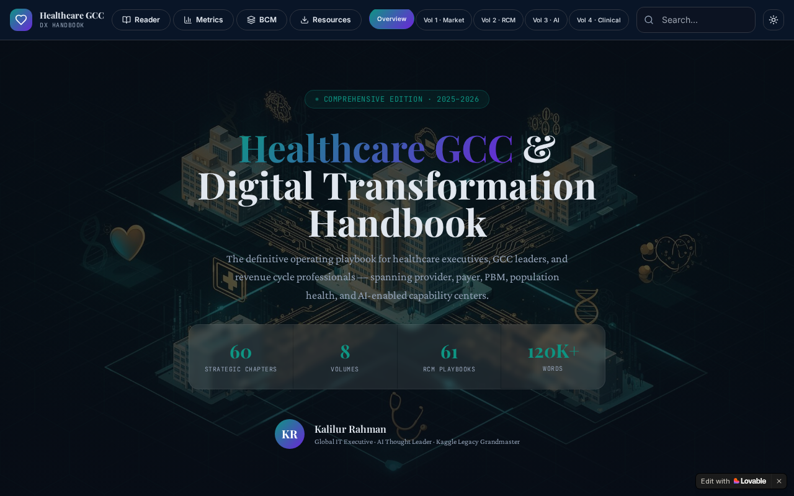
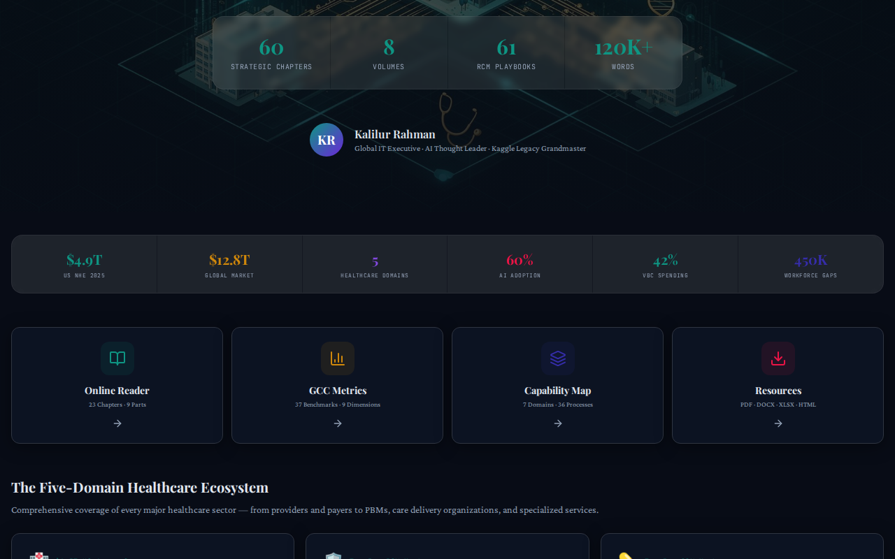
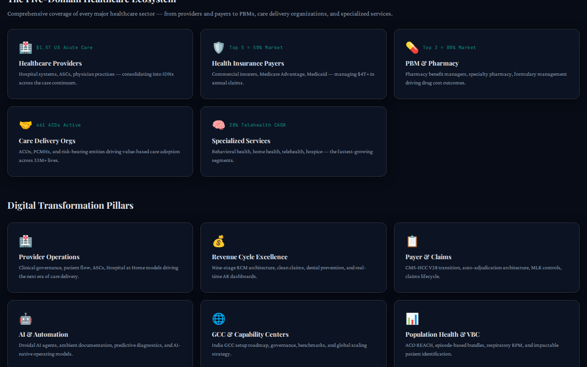
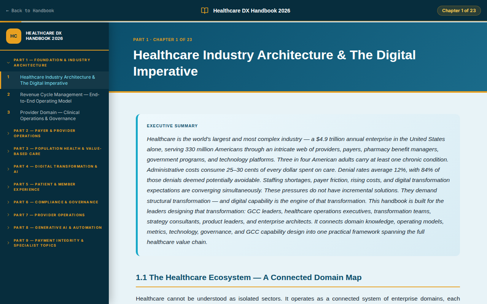
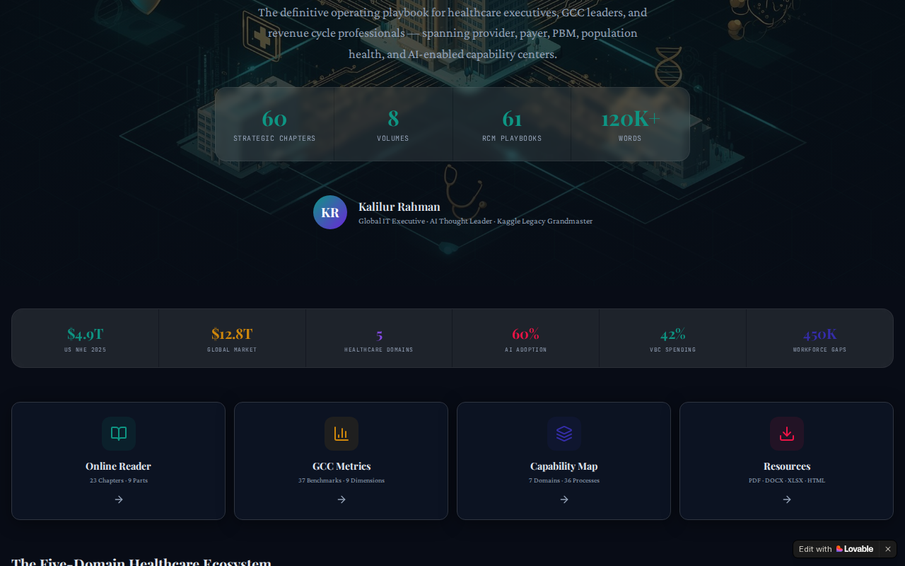
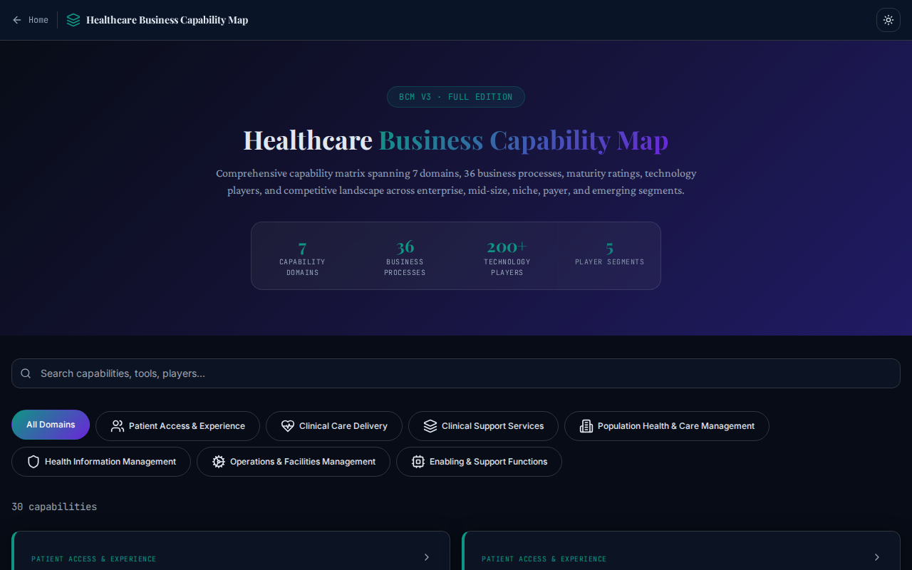

# Healthcare GCC Digital Transformation Handbook

A definitive guide to healthcare Global Capability Center (GCC) transformation in the AI era.

This application is a comprehensive, modern web platform designed to serve as a centralized hub for understanding the value chain, commercial aspects, enablers, and foundations of healthcare GCCs.

## Live Application
🌍 **[healthcare.kalilurrahman.com](https://healthcare.kalilurrahman.com)**

[](https://healthcare.kalilurrahman.com)
[](https://github.com/kalilurrahman/kr-healthcare-guidebook-hub)
[](#)
[](#)
[](#)

---

## Table of Contents
- [Overview](#overview)
- [Key Features & Modules](#key-features--modules)
  - [Reference Modules](#reference-modules)
  - [AI-Native Tools](#ai-native-tools)
- [Demo & Screenshots](#demo--screenshots)
  - [Themes](#themes)
  - [Sections](#sections)
  - [Views & Modals](#views--modals)
- [Architecture & Security](#architecture--security)
- [Testing](#testing)
- [Tech Stack](#tech-stack)
- [Installation & Setup](#installation--setup)
- [License](#license)

---

## Overview

The **Healthcare GCC Digital Transformation Handbook** provides deep insights into the healthcare industry's transformation. It features an interactive, modern interface with different sections outlining the various aspects of the healthcare ecosystem, including Business Continuity Management (BCM), Global Capability Center (GCC) Metrics, and a comprehensive Online Reader.

### Key Features & Modules

- **Interactive UI:** Fully responsive design built with React, TypeScript, and Tailwind CSS.
- **Dynamic Themes:** Built-in Light and Dark mode switching for optimal reading experience.
- **Eight Volumes, 60 Strategic Chapters** — the handbook's spine, navigable from the home page:
  - **Vol 1 · Market** — economics, payer mix, the margin-compression thesis
  - **Vol 2 · RCM** — the nine-stage revenue cycle, denials, coding & CDI, credentialing
  - **Vol 3 · AI** — AI-enabled operating models, agent enablement, ambient documentation, governance
  - **Vol 4 · Clinical** — pulmonary/COPD, RPM, device-to-data, respiratory outcomes
  - **Vol 5 · Ops** — provider, payer, PBM, post-acute, surgical and non-acute operations
  - **Vol 6 · GCC** — India GCC setup roadmap, governance, benchmarks
  - **Vol 7 · Growth** — specialty pharmacy, precision medicine, M&A, retail health
  - **Vol 8 · 2030** — the default-home vision, digital maturity, workforce, 90-day guide
- **Search** across every chapter, teaser and tag.

### Reference Modules

| Route | Module | What it is |
| --- | --- | --- |
| `/reader` | **Online Reader** | The 23-chapter, 9-part DX Handbook 2026 with executive summaries, KPI tables and board questions |
| `/gcc-metrics` | **GCC Maturity Metrics** | 37 benchmarked metrics across 9 maturity dimensions |
| `/bcm` | **Business Capability Map** | 7 capability domains, 36 business processes, and 200+ named technology players across five market segments |

### AI-Native Tools

Interactive tools built on the handbook's benchmarks. All three run **entirely in the browser** — no backend, no account, and no PHI is transmitted.

| Route | Tool | What it does |
| --- | --- | --- |
| `/diagnostic` | **RCM & GCC Maturity Diagnostic** | Scores 12 dimensions of revenue cycle, AI adoption and operating model against best-in-class benchmarks, returning a maturity band (L1 → L5) and a prioritized roadmap |
| `/appeal-forge` | **AppealForge** | Turns a payer + denial reason + claim details into a payer-specific, clinically-argued appeal letter, with the evidence checklist that maximizes overturn |
| `/note-qa` | **Ambient Note QA Scorecard** | Grades an ambient-scribe or clinical note against a 9-dimension completeness & CDI/coding rubric, flagging specificity gaps and ambient-AI safety issues |

Results from the Diagnostic and Scorecard can be copied or printed to a clean one-page PDF.

## Demo & Screenshots

Here is an animated demo of the site highlighting different themes and sections:



Here is a comprehensive visual summary of the application across different themes, sections, and views:

### Themes

The main portfolio site supports dynamic themes. Here is how it looks across different modes:

<div style="display: flex; gap: 10px; flex-wrap: wrap;">
  
  
</div>

### Sections

Detailed sections showcasing foundations, value chain, commercial aspects, enablers, and resources.

<div style="display: flex; gap: 10px; flex-wrap: wrap;">
  
  
</div>

### Views & Modules

Views showcasing the main application routes: the Online Reader, GCC Metrics dashboard, and BCM insights.

<div style="display: flex; gap: 10px; flex-wrap: wrap;">
  
  
  
</div>

## Architecture & Security

The Healthcare GCC Digital Transformation Handbook is a **static, purely informational single-page application (SPA)**.

- There is **no backend server** and no database.
- There is **no login, authentication flow, or authorization logic** anywhere in the repository.
- All content (chapters, metrics, capability map) is statically served from `src/data/` and `public/data/`.

**On the interactive tools.** The Diagnostic, AppealForge, and Note QA Scorecard run **100% client-side**. Nothing typed into them — including any clinical note or claim detail — is transmitted, logged, or persisted; it never leaves the browser tab. Deterministic logic is used throughout (scoring rules, templates, and rubric matching), so there is no model inference and no third-party API call at runtime.

> ⚠️ **These tools produce drafts and advisory scores, not clinical or billing decisions.** Every output must be reviewed by a qualified professional before use. De-identify any note before pasting it.

**Data provenance.** Every industry statistic carries a required `asOf` vintage rendered alongside it. The figures are curated literals reflecting the latest public data available for this edition — the ticker is *not* a live feed, and is labeled accordingly.

## Testing

```bash
npm test              # vitest — unit + rubric regression tests
npx tsc --noEmit -p tsconfig.app.json   # typecheck (note: `vite build` does NOT typecheck)
npx eslint .          # lint
```

## Tech Stack

- **Frontend:** TypeScript, React, Tailwind CSS, HTML5
- **Icons:** Lucide React
- **Animations:** Framer Motion
- **Build Tool:** Vite
- **Testing/Automation:** Vitest, Playwright

## Installation & Setup

1. Clone the repository:
   \`\`\`bash
   git clone https://github.com/kalilurrahman/kr-healthcare-guidebook-hub.git
   \`\`\`

2. Install dependencies:
   \`\`\`bash
   npm install
   \`\`\`

3. Build and Preview the application:
   \`\`\`bash
   npm run build && npm run preview
   \`\`\`

## License
MIT License
